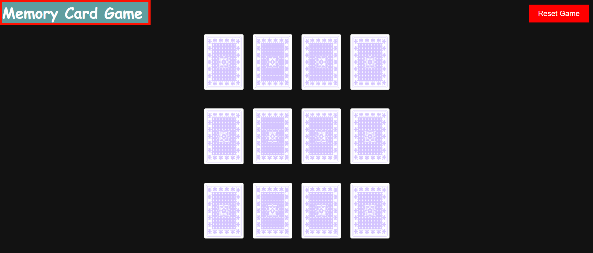

# Memory Card Game
### What This Game Is About
This is a Memory Card Game where you flip cards and try to match pairs. If you match all of them, you win! There's also a Reset Game button to shuffle the cards and start over.

***

## How I Made It
- HTML - Started with HTML – Set up the basic structure, including the cards, the game area, and the reset button.

- CSS - Styled with CSS – Made it look nice, added spacing, colors,the h1 tag moved it to left corrner and put the reset button in the top-rightcorner.

- JAVASCRIPT - Added JavaScript – Made the game work! Cards shuffle, you can click to flip them, and it checks if you get a match. The game also shows a winner message when all cards are matched.

***
Preview
Here’s how the game looks:

## Game Preview

